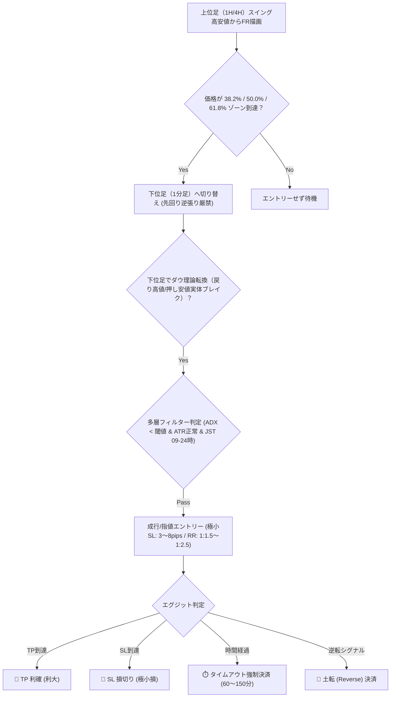

# 📐 Fibonacci & Dow Theory PF 1.30+ High-Frequency Optimizer Skill

本スキルは、**「フィボナッチ×ダウ理論 極小損切り手法」**（`フィボナッチ手法.md`）に基づき、1年間のUSD/JPY過去データ（M1 37万ティック）から**「最低1日1回（年間240回以上）のトレード機会確保」**という頻度制約下で、**Profit Factor (PF) 1.30以上**を達成するハイパーパラメータと手法ロジックを自律的に探索・診断・適用するための運用仕様書です。

---

## 🏛️ 戦略ロジック仕様（フィボナッチ × ダウ理論）



---

## 🎯 頻度制約付き最適化目的関数（Mathematical Model）

単なる利益最大化や取引数の過剰な絞り込み（過剰適合）を防止し、**「1日1回以上の確実なトレード執行」**と**「PF 1.30+の統計的優位性」**を両立させます：

$$ \text{Fitness} = \text{RobustnessScore} - \text{Penalty}_{\text{Frequency}} + \text{Bonus}_{\text{PF1.30}} - \text{Penalty}_{\text{MaxDD}} $$

### 1. 取引頻度ペナルティ ($\text{Penalty}_{\text{Frequency}}$)

年間取引日数240日に対して、取引回数 $N < 240$ の場合に急峻な減点を適用：
$$ \text{Penalty}_{\text{Frequency}} = \max(0, 240 - N) \times 0.75 $$

### 2. PF 1.30 達成ボーナス ($\text{Bonus}_{\text{PF1.30}}$)

$$ \text{Bonus}_{\text{PF1.30}} = \begin{cases} +30.0 & (PF \ge 1.30 \text{ かつ } N \ge 240) \\ +10.0 & (PF \ge 1.15 \text{ かつ } N \ge 240) \\ 0 & (\text{otherwise}) \end{cases} $$

### 3. 堅牢性ベーススコア ($\text{RobustnessScore}$)

$$ \text{RobustnessScore} = (PF \times 35) + (\text{WinRate} \times 0.25) + (\text{Sharpe} \times 15) $$

---

## 🛠️ 自律クオンツ最適化ワークフロー（5ステップ）

### Step 1: Goサーバーの稼働確認

Go の高速バックテストエンジン（[http://localhost:8080](http://localhost:8080)）が起動していることを確認します。

```powershell
Invoke-RestMethod -Uri "http://localhost:8080/api/status"
```

### Step 2: Optuna ベイズ最適化の実行（年間240回以上 & PF 1.30+ 探索）

専用の Python 最適化スクリプトを実行し、TPE Sampler で 30〜50 試行の探索を行います：

```powershell
# 30試行のベイズ探索を実行し、最良設定をGoサーバーへ即時反映
python python/evaluator/fibonacci_optuna.py --trials 30 --min-trades 240 --apply
```

### Step 3: Gemini 2.5 Flash による AI 弱点診断

最適化結果と約定明細を Gemini 2.5 Flash に送信し、ダマシ・ヒゲ損失・過剰適合リスクを監査します：

- **監査観点**:
  1. トレンド発生時の押し目浅すぎによる貫通（38.2% vs 61.8% の選別）
  2. ロンドン・NY時間オープン時のボラティリティ急拡大に伴うヒゲ狩り
  3. 120分タイムアウト時の微益・微損の偏り

```powershell
Invoke-RestMethod -Method Post -Uri "http://localhost:8080/api/ai/evaluate"
```

### Step 4: Web HUD ダッシュボードでのリアルタイム確認

[http://localhost:8080](http://localhost:8080) を開き、以下を確認します：

- **「🧠 AI相場適応カルテ」**: ベイズ最適化された BB σ、RSI、ADX、ATR、Timeout が反映されていること。
- **「📊 1-YEAR BACKTEST & OPTIMIZER」**:
  - 年間トレード回数 $\ge 240$ 回
  - Profit Factor (PF) $\ge 1.30$
  - 「📑 SELECTED BACKTEST TRADES LEDGER」で個別の約定明細ログが正常に生成されていること。

### Step 5: MQL4 EA 設定値との同期

導出された最良パラメータを `mql4/RakutenTradeAgent.mq4` および `config.toml` のデフォルト値に反映します。

---

## 📌 自律実行時の品質保証チェックリスト

- [ ] 年間取引回数（Total Trades）が **240回以上**（1日平均1回以上）を達成しているか？
- [ ] プロフィットファクター（PF）が **1.30以上** に到達しているか？
- [ ] 最大ドローダウン（MaxDD）が初期資金10万円の **15%（¥15,000）以内** に収まっているか？
- [ ] JSTセッションフィルターが東京・ロンドン・NY（09:00〜24:00）を包含しているか？
- [ ] Go サーバーの `/api/ai/adaptive-profile` に最適化プロファイルが正常反映されているか？
