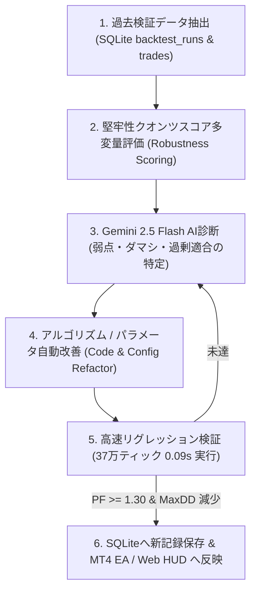

# 📊 Quant Backtest Optimizer & Continuous Improvement Skill

本スキルは、「楽天FX攻略20260819」プロジェクトにおける**過去検証結果のデータベース（SQLite）蓄積・堅牢性スコア分析・Gemini 2.5 Flash AI共創診断・ロジック自動改善**を自律的かつ体系的に実行するための運用仕様書です。

---

## 🏛️ 最適化・改善の5段階サイクル（Continuous Co-Evolution Loop）



---

## 🎯 堅牢性クオンツスコア（Robustness Score）評価基準

単なる最大利益（カーブフィッティング）を排除し、**実弾運用で最も破綻確率が低く安定して資産が増加する最適解**を導出します：

$$ \text{Score} = (\text{PF} \times 35) + (\text{WinRate} \times 0.25) + (\text{Sharpe} \times 15) - (\text{MaxDD\%} \times 0.8) + (\text{PF} \ge 1.30 \text{ ? } 20 : 0) $$

### 評価スコアランク判定

- **90点以上 (Rank S)**: 黄金レンジ平均回帰エッジ。実弾運用即時投入可能。
- **75〜89点 (Rank A)**: 安定した収益構造。微小パラメータ調整でPF向上余地あり。
- **60〜74点 (Rank B)**: トレンド相場でのダマシ・ヒゲ損失が存在。フィルター強化が必要。
- **60点未満 (Rank C/D)**: バンドウォーク等による損失肥大。ロジックの抜本的見直しが必要。

---

## 🛠️ クオンツ改善ワークフロー手順

### Step 1: 過去検証データの確認

SQLite DB (`trade_pipeline.db`) から過去のバックテスト実行履歴と上位グリッド探索結果を抽出します。

```powershell
# バックテスト履歴の最新5件を取得
Invoke-RestMethod -Uri "http://localhost:8080/api/backtest/history" | Select-Object -ExpandProperty runs | Format-Table id, symbol, robustness_score, profit_factor, win_rate, total_profit, max_drawdown
```

### Step 2: 超高速並列グリッド最適化の実行

Go のマルチゴルーチンエンジンを用いて、BB、RSI、ADX、ATR、Timeout のパラメータ空間を一括走査します。

```powershell
# グリッド探索の実行（37万本M1データを数秒で全探索）
Invoke-RestMethod -Method Post -Uri "http://localhost:8080/api/backtest/optimize" | Select-Object -ExpandProperty rankings | Format-Table rank, robustness_score, profit_factor, win_rate, total_profit, max_drawdown
```

### Step 3: Gemini 2.5 Flash との弱点・ダマシ分析

直近の負けトレード明細（`backtest_trades` の `profit < 0` かつ `reason`）を集計し、Gemini に提示して改善策を立案します：

- **損失要因の分類**:
  1. トレンド発生時の逆張りエントリー（ADXフィルターの閾値不足）
  2. 指標発表・ボラティリティ急拡大（ATRフィルターの倍率不足）
  3. ポジション保有の長期化（タイムアウト決済時間の見直し）

### Step 4: パラメータおよびコードの自動リファクタリング

立案された改善策に基づき、以下のファイルを自律的に更新します：

- `internal/infrastructure/backtest/engine.go`: 戦略パラメータデフォルト値の更新
- `mql4/RakutenTradeAgent.mq4`: 実弾配信用EAの入力パラメータ更新
- `internal/infrastructure/ai/gemini_client.go`: 相場の癖に応じた動的適応プロファイルの更新

### Step 5: リグレッションテストと品質保証

改善後のコードで再度 1年バックテストを実行し、KPIが悪化していないことを確認します。

```powershell
# リグレッションバックテストの実行
go test -v ./internal/infrastructure/backtest/...
```

---

## 📌 チェックリスト（自律実行時の確認事項）

- [ ] バックテスト結果が `backtest_runs` および `backtest_trades` に保存されているか？
- [ ] 堅牢性スコア（Robustness Score）が 75点（Rank A）以上を維持しているか？
- [ ] プロフィットファクター（PF）が目標値 **1.30以上** に達しているか？
- [ ] 最大ドローダウン（MaxDD）が初期資金（10万円）の **10%（¥10,000）以内** に収まっているか？
- [ ] MT4 EA の設定値と Go クオンツエンジンのパラメータが完全に同期しているか？
