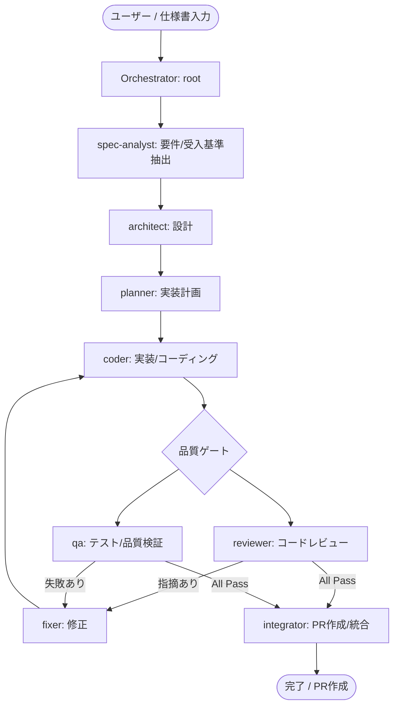

# Docker Agent 自律型開発パイプライン

Docker 社公式の AI Agent Builder & Runtime **「Docker Agent (`docker/docker-agent`)」** を採用した、自律型マルチエージェント開発基盤です。

参考記事: [YAML 1枚で開発エージェントチームを動かす — 開発基盤に Docker Agent を採用した話 (Zenn)](https://zenn.dev/xtm_blog/articles/b9993fe1d72b17)

---

## 🎯 アーキテクチャとエージェント構成

仕様書を入力すると、各専門エージェントが連携して PR 作成までを自律的に進行します。



### エージェントの役割と権限 (最小権限の原則)

| エージェント | モデル種別 | 主な役割 | 許可ツール |
| :--- | :--- | :--- | :--- |
| **`root`** | `main` | パイプライン全体の統括・タスク委譲 | `think`, `filesystem`, `tasks` |
| **`spec-analyst`** | `lite` | 仕様書からの要件・受入基準の抽出 | `think`, `filesystem`, `fetch` |
| **`architect`** | `main` | アーキテクチャ・モジュール・型設計 | `think`, `filesystem` |
| **`planner`** | `lite` | 段階的な実装計画・TODOリスト作成 | `think`, `filesystem`, `todo` |
| **`coder`** | `main` | ソースコード＆単体テスト実装 | `think`, `filesystem`, `todo`, `shell` |
| **`reviewer`** | `lite` | コード品質・規約遵守・セキュリティ検証 | `think`, `filesystem` |
| **`qa`** | `main` | テストスイート実行・受入基準合致検証 | `think`, `filesystem`, `shell` |
| **`fixer`** | `main` | 指摘事項のバグ修正・リファクタリング | `think`, `filesystem`, `shell` |
| **`integrator`** | `lite` | 最終差分確認・Gitコミット・PR本文作成 | `think`, `filesystem`, `shell` |

---

## 🚀 クイックスタート

### 1. 前提条件のインストール

**Windows の場合 (winget):**

```powershell
# Docker Agent CLI のインストール
winget install Docker.Agent

# または Docker Desktop 4.63 以降をインストール
winget install Docker.DockerDesktop
```

**macOS の場合 (Homebrew):**

```bash
brew install docker-agent
```

### 2. 環境変数の設定

`.env.example` をコピーして `.env` を作成し、使用する LLM プロバイダの API キーを設定します。

```powershell
Copy-Item .env.example .env
```

`.env` 例:

```ini
GEMINI_API_KEY=AIzaSy...
# OPENAI_API_KEY=sk-...
# ANTHROPIC_API_KEY=sk-ant-...
```

### 3. パイプラインの実行

PowerShell ランナースクリプトを実行します。

```powershell
# 対話モードで起動
.\scripts\run-pipeline.ps1

# プロンプトを直接指定して起動
.\scripts\run-pipeline.ps1 -Prompt "ユーザー登録機能のバリデーション処理を追加してください"

# 直前のセッションを再開する場合
.\scripts\run-pipeline.ps1 -ResumeLastSession
```

直接 CLI を叩く場合：

```powershell
docker agent run agent.yaml
# または
docker-agent run agent.yaml
```

---

## 📁 ディレクトリ構成

```text
.
├── agent.yaml                       # エージェントチーム・モデル定義
├── skills/                          # エージェント共通規約・プロンプトテンプレート
│   ├── agent-workflow-general-rule/ # 共通開発規約（DDD、型安全、コミットルール等）
│   │   └── SKILL.md
│   └── pr-template/                 # PR作成テンプレート
│       └── SKILL.md
├── scripts/
│   └── run-pipeline.ps1             # セッション管理・ログ自動生成ランナー
├── runs/                            # [自動生成] 実行ごとのセッション・監査ログ
│   └── YYYY-MM-DD-HHMMSS-<id>/
│       ├── session.db               # SQLite セッション履歴
│       ├── meta.json                # 実行メタデータ
│       └── artifacts/               # 生成成果物
├── .env.example                     # 環境変数設定サンプル
├── .gitignore
└── README.md
```

---

## ⚙️ カスタマイズ

### モデルの切り替え (`agent.yaml`)

`models:` セクションを変更するだけで、プロバイダを即座に変更できます。

```yaml
models:
  main:
    provider: openai
    model: gpt-4o
  lite:
    provider: openai
    model: gpt-4o-mini
```

また、ローカル LLM（Docker Model Runner）を使用する場合は以下のように指定可能です。

```yaml
models:
  main:
    provider: dmr
    model: qwen2.5-coder:14b
```
