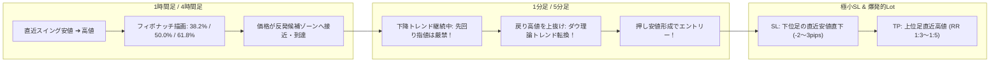

# 📐 楽天FX・フィボナッチ × ダウ理論「極小損切り」勝率特化型トレードマニュアル

---

## 📌 1. コア哲学：なぜ「極小損切り × 爆発的リワード」が実現するのか

本手法の最大の強みは、**「上位足の反発候補（フィボナッチ）」** と **「下位足のトレンド転換（ダウ理論）」** を掛け合わせることで、**受け入れるリスク（損切り幅）を極小（数pips）に抑えつつ、狙うリワード（上位足の波動全体）を最大化**する点にあります。

---

## 🎯 2. 監視する「黄金の3数値」

フィボナッチ・リトレースメント（FR）の全数値を追う必要はありません。大口トレーダー・アルゴリズムが最も意識する**「3つの反発ライン」**だけに絞り込みます。

| フィボナッチ比率 | 性質・相場環境 | 立ち回り |
| :--- | :--- | :--- |
| **`38.2%`** | **強烈なトレンド相場（浅い押し目）** | 勢いが強い相場。下位足での切り返しが早いため、1分足での初動ブレイクを狙う。 |
| **`50.0%` (半値)** | **標準的なトレンド相場（王道の押し目）** | 最も注文が交錯し反発確率が高い。ロールリバーサル（水平線）との重複率No.1。 |
| **`61.8%`** | **深い押し目（黄金比・限界防衛ライン）** | これを超えて78.6%を割るとトレンド崩壊。反発した際のリワード幅（RR）が最大化する。 |

---

## 🪜 3. エントリー完全手順（4ステップ）

### 【Step 1: 上位足でフィボナッチを描画】
- 1時間足（または4時間足）で、明確なモメンタムを伴う「直近スイング安値（100.0%）」から「直近スイング高値（0.0%）」に向けてFRを引く。
- 価格が **`38.2%` / `50.0%` / `61.8%`** のゾーンに差し掛かるまで**一切エントリーせず待機**。

### 【Step 2: 下位足（買足: 1分足/5分足）へ切り替え】
- 価格がライン付近に到達した瞬間、下位足へ切り替える。
- ⚠️ **絶対禁止事項（コツ1）**: 上位足ラインにタッチした瞬間の**「先回り指値（逆張り買い）」は厳禁**。下位足ではまだ急落（下降トレンド）の最中であるため、貫通されて大損する原因になる。

### 【Step 3: 下位足のダウ理論転換（戻り高値ブレイク）を確認】
- 下位足のローソク足が高値・安値を切り下げる下降トレンドから、**「直近の戻り高値」を実体で力強く上抜ける瞬間**を待つ。
- ブレイク確認後、一度押して作った**「押し安値」**の形成を確認して成行/指値エントリー。

### 【Step 4: 極小損切り（SL）と利確（TP）の発注】
- **損切り（SL）**: 上位足の安値ではなく、**「下位足で反発して作った直近最安値のわずか2〜3pips外側」**に置く。
- **利益確定（TP）**:
  - **TP 1（50%利確）**: 上位足の直近高値（0.0%ライン）。到達時に残り半分のSLを**建値**へ移動。
  - **TP 2（残り50%）**: フィボナッチ・エクスパンション **161.8%**。

---

## 🛡️ 4. 極小損切り × ロット最適化の数学モデル

損切り幅（SL pips）が極小になることで、**1トレードの許容リスク（2,000円）を固定したまま、ロット数を劇的に引き上げることが可能**になります。

### 📐 ロット計算式
$$\text{Lot Size} = \frac{\text{許容損失額 (2,000円)}}{\text{SL幅 (pips)} \times \text{1pipあたり価値 (1,000円/Lot)}}$$

### 📊 損切り幅とリターンの比較表（USD/JPY 許容リスク2,000円の場合）

| 手法・エントリー | 損切り幅 (SL) | ロット数 (Lot) | 獲得利幅 (TP: 30pips) | 獲得利益額 | リスクリワード (RR) |
| :--- | :---: | :---: | :---: | :---: | :---: |
| 従来の先回り指値 | 20.0 pips | 0.10 Lot (1万通貨) | +30.0 pips | +3,000 円 | 1 : 1.5 |
| **本手法（下位足ダウ転換）** | **4.0 pips** | **0.50 Lot (5万通貨)** | **+30.0 pips** | **+15,000 円** | **1 : 7.5** |

> [!IMPORTANT]
> 同じ30pipsの利益目標でも、損切り幅を4pipsに絞ることでロットを5倍に引き上げることができ、**リスク（2,000円）は変えずに利益を5倍（15,000円）**に増幅できます。

---

## 🧠 5. トレード規律と心理フレームワーク（コツ3: ダウ崩壊＝即撤退）

1. **「自分のシナリオが否定されたら即座に撤退」**:
   - 下位足の押し安値を下回った瞬間、ダウ理論の上昇シナリオは完全崩壊したことになります。「まだ戻るかも」という感情を挟む余地はありません。
2. **「連敗しても口座残高のダメージは軽微」**:
   - 損切りが極小（数pips）であるため、たとえ3連敗しても損失は固定リスク内に収まり、1回の勝ち（RR 1:5）で瞬時に最高益を更新できます。

---

## 📋 6. 実戦エントリー・チェックシート

- [ ] **1. 上位足の環境**: 上昇スイングのFR 38.2% / 50.0% / 61.8% のいずれかに到達したか？
- [ ] **2. 先回り抑制**: 上位足タッチでの当てずっぽうな指値をしていないか？
- [ ] **3. 下位足切り替え**: 1分足・5分足で戻り高値を実体でブレイクしたか？
- [ ] **4. 極小SL設定**: エントリーと同時に、下位足直近安値-2pipsの位置にSLを入れたか？
- [ ] **5. ロット逆算**: SL幅（例: 4pips）から許容損失2,000円に見合うロット（0.50Lot）を算出したか？
- [ ] **6. 分割決済予約**: TP1（上位足高値0.0%）で半分利確＋建値トレールを設定したか？
