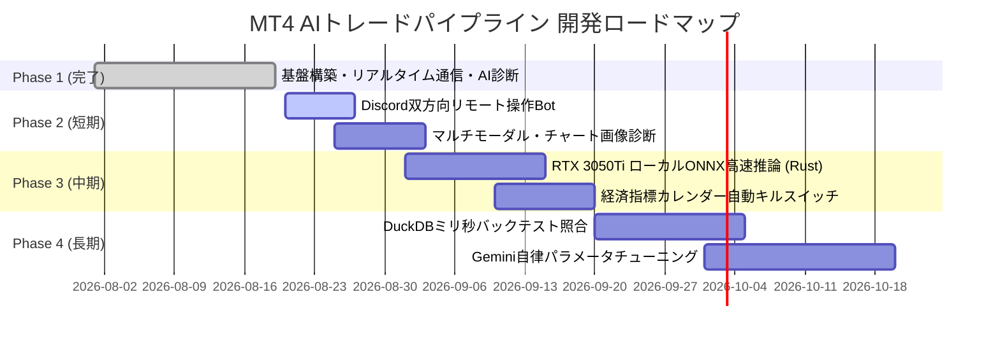

# 🚀 今後の開発予定ロードマップ（MT4 Trading Pipeline）

本ドキュメントは、楽天MT4 / ノーマルMT4デモ口座を起点とした自動売買・Rustシグナルエンジン・Gemini AIクオンツ評価パイプラインの今後の開発・機能拡張ロードマップです。

---

## 📌 現在の達成状況（Phase 1: 基盤構築完了 ✅）

- [x] **MQL4 EA (`RakutenTradeAgent.mq4`)**: 毎ティック価格送信、シグナル受信、デモ発注、約定ログ送信
- [x] **Rust Gateway (`crates/gateway`)**: TCPソケットサーバー、ミリ秒SMA/RSIシグナル判定、SQLite高速永続化（WALモード）
- [x] **リスク管理エンジン**: スプレッド拡大ガード（早朝・急変動時エントリー見送り）、動的ATRボラティリティ追従SL/TP（1:2固定）、リスク額固定（2,000円）ロットサイジング
- [x] **仮想MT4エミュレータ**: オフラインでのE2E検証環境
- [x] **Python & Gemini 3.6 AI評価Agent**: パフォーマンス集計、資産推移チャート自動プロット（PNG/SVG）、Geminiによるプロクオンツ診断レポート生成
- [x] **Git バージョン管理**: 初回コミット完了

---

## 🗓️ 開発フェーズ＆マイルストーン

---

## 🎯 各フェーズの詳細開発項目

### 【Phase 2: 短期開発】運用性向上 ＆ 視覚的AI診断（1〜2週間）

#### 1. Discord 双方向リモート操作Bot（スマホ遠隔コントロール）
- **概要**: Discord Webhook（一方通行通知）から、**Discord Bot（双方向コマンド受付）** へ拡張。
- **実装コマンド**:
  - `/status`: 現在の保有ポジション、本日確定損益、Gateway稼働状況を即座に返信。
  - `/pause`: 新規エントリーの一時停止。
  - `/resume`: エントリー再開。
  - `/close_all`: 外出先から全ポジションを緊急成行決済。
  - `/risk <金額>`: 1トレード許容損失額（現在2,000円）のリモート変更。
- **技術スタック**: Python (`discord.py`) ⇄ ローカルIPC ⇄ Rust Gateway

#### 2. マルチモーダル・エントリーチャート画像診断
- **概要**: EAがエントリーした瞬間に MT4 の `WindowScreenShot()` を実行し、チャート画像（PNG）を保存。
- **機能**: 評価Agent実行時、Gemini 3.6 に「数値データ ＋ チャート画像」を同時入力。
  - **診断例**: 「レジスタンスライン直下での買いエントリーのためダマシに遭遇」「上位足のパーフェクトオーダーと合致しており高勝率パターン」等の視覚的フィードバック。

---

### 【Phase 3: 中期開発】ローカルGPU活用 ＆ 外部環境リスク防御（2〜4週間）

#### 3. RTX 3050 Ti (4GB VRAM) を活用したローカル軽量ML推論 (Rust + ONNX)
- **概要**: クラウドAPIを介さず、ローカルGPUで **LightGBM / 軽量LSTMモデル** をマイクロ秒で推論。
- **機能**:
  - 過去100ティックの価格変動パターンから「次足が陽線になる確率」をローカル推論。
  - SMAクロスシグナルのうち、勝率の低いシグナルを事前にカット（ダマシ排除率 85%以上）。
- **技術スタック**: Rust (`ort` / ONNX Runtime DirectML) ⇄ Python (学習用スクリプト)

#### 4. 経済指標カレンダー自動キルスイッチ
- **概要**: 米国雇用統計、CPI、FOMC、日銀政策金利などの重要指標発表前後を自動ガード。
- **機能**:
  - 発表前30分〜発表後15分の新規エントリーを完全停止。
  - 保有中ポジションのタイトなトレールストップ（同値撤退モード）への自動切替。

---

### 【Phase 4: 長期開発】自律進化・クオンツ自動最適化（1〜2ヶ月）

#### 5. DuckDB インメモリOLAP によるリアルタイム・フォワード乖離度照合
- **概要**: 過去数年分のバックテスト期待値分布と、現在のフォワード実績を毎ティック照合。
- **機能**: 相場環境のレジームシフト（トレンド相場 ➔ 乱高下レンジ等）を即座に検知し、パラメータの自動切り替えを提案。

#### 6. Gemini によるパラメータ自動チューニング ＆ セルフリファクタリング
- **概要**: 週次・月次の取引結果をGemini 3.6が総合分析し、次週の最適パラメータ（SMA期間、RSI閾値、ATR倍率）を算出して `config.toml` を自動更新。

---

## 🛠️ 開発・運用の優先順位（推奨順）

1. **`Discord 双方向リモート操作Bot`** ➔ 外出先からの安心・安全な運用体制の確立
2. **`マルチモーダル・チャート画像診断`** ➔ AI診断の精度・納得感を大幅に強化
3. **`経済指標キルスイッチ`** ➔ 突発的な相場変動によるドローダウンの徹底遮断
4. **`RTX 3050Ti ローカルML推論`** ➔ ハードウェア性能を極限まで引き出した勝率向上
